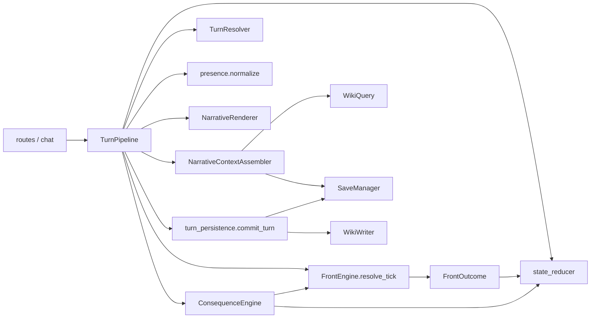
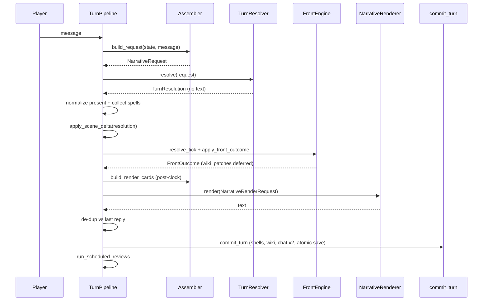
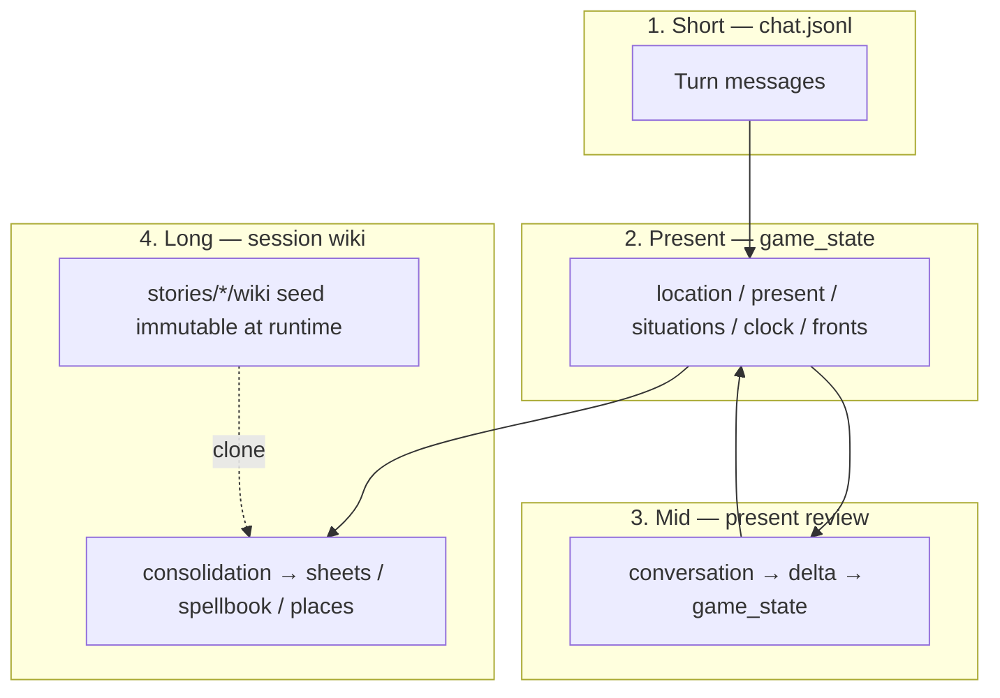
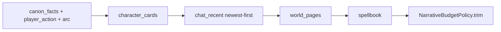

# iaSimulationStory

Layered-memory narrative simulator: a single **state authority**, **two-pass** turns (resolve → render), and setting packs separated from the engine.

**Copyright (c) 2026 Davide Tarquini** — released under the [MIT License](LICENSE). You may use, modify, and redistribute this project (including the architecture and ideas) freely, provided the copyright and license notice are preserved.

---

## Quick start

### Backend

```powershell
cd backend
python -m venv .venv
.\.venv\Scripts\Activate.ps1
pip install -r requirements.txt
copy ..\.env.example ..\.env
# Fill API keys in .env (see Configuration)
uvicorn app.main:app --reload --app-dir .
```

### Frontend

```powershell
cd frontend
npm install
npm run dev
```

- UI: http://localhost:5173  
- API: http://127.0.0.1:8000  

On a phone (same Wi‑Fi), from the repo root:

```powershell
.\start.ps1
```

or `start.cmd`. Open `http://<PC-IP>:5173` (Vite proxies `/api` in dev).

### Wiki seed (local)

Setting wiki content is built locally from sources:

```powershell
copy sources.example.yaml sources.yaml
# edit sources.yaml with real URLs
cd backend
python scripts/fetch_sources.py
python scripts/ingest.py
```

Per story pack, also copy meta if needed:

```powershell
copy stories\overlord\meta.example.yaml stories\overlord\meta.yaml
# edit start_location, default_front, playable_characters, …
```

`wiki/` under each story pack is local (not in git). Build sheets via ingest from `sources.yaml`; keep fronts/overlays/index with your private seed.

---

## Setting packs

- **Engine** (`backend/prompts/`): generic turn, review, and structural ingest rules.
- **Pack** (`stories/<id>/`): local `meta.yaml` (from `meta.example.yaml`), local `wiki/` seed (fronts, sheets, overlays), optional `prompts/ingest.md`.
- Base sheets = invariants; overlays `wiki/overlays/<arc_id>/` = era titles / goals / knowledge.
- At runtime `WikiQuery` merges base + active overlays (combat/magic sections in overlays are ignored).
- A new setting ≈ a new pack, without rewriting engine prompts.

Ingest (`--force`, `--only`, `--limit` on `ingest.py`) writes only to the seed, runs linkify at the end, and each new session clones the seed into `saves/<id>/wiki/`.

---

## API

| Method | Path | Purpose |
|--------|------|---------|
| GET | `/api/config` | Review intervals / UI config |
| GET | `/api/stories` | Available stories |
| GET | `/api/saves`, `/api/saves/active` | Sessions |
| POST | `/api/session` | New game (`story_id`, `player_name`) |
| GET | `/api/session/{id}` | State + chat |
| GET | `/api/session/{id}/sheet` | Player sheet |
| GET | `/api/session/{id}/spellbook` | Spellbook |
| GET | `/api/session/{id}/arc-timeline` | Arc timeline |
| POST | `/api/chat` | Player action |
| POST | `/api/end-scene` | Session wiki consolidation |
| GET | `/api/state/{id}`, `/api/chat/{id}` | State / full chat |

Without LLM keys the backend can answer with mock text for smoke tests.

### Configuration (`.env`)

See `.env.example`:

- `OPENAI_API_KEY`, `LLM_API_BASE_URL` — review / ingest  
- `OPENROUTER_API_KEY` — narrative when the model slug is `provider/model`  
- `GEMINI_API_KEY` — when the model name starts with `gemini`  
- `LLM_MODEL_NARRATIVE` / `RESOLVE` / `RENDER` / `REVIEW` / `INGEST`  
- `PRESENT_REVIEW_EVERY_N`, `CONSOLIDATE_EVERY_N`  
- budget: `NARRATIVE_TOKEN_BUDGET`, `NARRATIVE_CHAT_MESSAGES`, `WIKI_PAGE_CAP`, `WORLD_EXCERPT_CHARS`, `LLM_MAX_OUTPUT_TOKENS`, `NARRATIVE_MAX_WORDS`  

Empty `RESOLVE` / `RENDER` fall back to `LLM_MODEL_NARRATIVE`. Full defaults live in `backend/app/config.py` (`0` disables the related limit).

---

## Architecture

### Components



### Turn sequence (two-pass)



Turn stance: `action` | `passive` | `wait`.

- `passive` — small observable delta  
- `wait` — advances plausible time until a beat, without forcing the next beat  
- explicit dialogue → always `action`

### Memory (4 layers)



| Layer | Path | Writer | Lifecycle | Belongs here | Does not belong |
|-------|------|--------|-----------|--------------|-----------------|
| Canon seed | `stories/<story_id>/wiki/` | Ingest/CLI only | Cloned into new games; never mutated at runtime | Canon, front YAML, index | Session memories / open threads |
| Session wiki | `saves/<session_id>/wiki/` | Consolidation + beat `wiki_writes` + spellbook | Private per adventure | Dense memories, open threads, place events/tensions, spellbook | Micro-actions, momentary tone, raw transcript |
| Mid state | `saves/<session_id>/game_state.json` | TurnPipeline + present review | Every turn (atomic save) | location, present, situations, clock, fronts, mood/relationships | Long canon, undued future beats |
| Short chat | `saves/<session_id>/chat.jsonl` | `commit_turn` | Append per exchange | Turn prose + player actions | Wiki patches, internal counters |

**Promotion:** chat → present review → situations/runtime → consolidation → session wiki.  
**Removal:** present review drops stale situations; consolidation may `state_cleanup` after promotion.

### Context budget



`NarrativeBudgetPolicy` trims by priority up to `narrative_token_budget` (`0` = off): core → NPC cards → recent chat (newest first) → world → spellbook → arc trim.

---

## Turn context contract

The turn is **two-pass**. Pass 1 decides *what happened* as structured facts (no prose). Pass 2 turns those facts into player-facing text. Clock, location, and presence are applied **between** the passes, so the renderer always sees **post-clock** canon.

### What goes into the LLM

| Kind | Fields | Notes |
|------|--------|--------|
| **Always** | `player_action`, `canon_facts`, `stance`, `chat_recent`, `story_context` | Core continuity |
| **Pass 1 only** | `active_arc` | Current front slice (beats / era). Empty if no active front |
| **Selective** | `character_cards`, `world_pages`, `spellbook` | On-scene NPCs; place/mention pages; known spells |
| **Pass 2 only** | `scene_brief`, `temporal_context`, `fired_beat_summaries`, `interrupt_hint` | After resolve + front tick |
| **Never (renderer)** | Upcoming beats / future `active_arc` | Avoids spoilers and railroading |

**`canon_facts`** (absolute for both passes; Pass 2 sees them after clock/location/present updates):

- `location` — current place id  
- `time` — label (`Giorno N · fase`)  
- `present` — NPCs physically with the PC  
- `situations` — mid-term open threads (serialized with an epistemic note: continuity for the *model*, not automatic NPC knowledge)  
- `extra` — free-form structured flags  

**`story_context`** — genre + narrative style from the pack `meta.yaml`.  
**`stance`** — `action` | `passive` | `wait` (classified from the player message).

### Player-action grammar (both passes)

Markers are interpreted in **literal order** (do not reorder):

| Marker | Meaning |
|--------|---------|
| `"..."` / `«...»` | Spoken dialogue |
| `[Name — desc]` / `[Name]` | Spell cast (new spell → `spells[]`; bare name → do not invent a description) |
| `*...*` | Private thought (NPCs do not hear it) |
| Free text | Physical / scene action |

### Pass 1 — Resolver (`turn_resolve.md`)

**Input:** `NarrativeRequest`  
`canon_facts`, `active_arc`, `world_pages`, `character_cards`, `spellbook`, `chat_recent`, `player_action`, `stance`, `story_context`

**Output:** `TurnResolution` — **no `text` field**:

| Field | Meaning |
|-------|---------|
| `time` | `{ bucket, minutes }` — clock advance (`istantanea` / `breve` / `media` / `lunga` / `riposo`) |
| `location` | New place id if the PC moved; else `null` |
| `present` | Full replacement list of who is with the PC; `null` = unchanged; `[]` = alone |
| `spells[]` | Newly declared `[Name — desc]` only |
| `scene_brief[]` | 1–4 **fact bullets** for the renderer (deltas, not prose) |
| `situations_add[]` / `situations_remove[]` | Mid-term threads to open/close (`remove` must match existing strings) |

Stance shapes the brief: `passive` / `wait` keep deltas small; explicit dialogue stays `action`.

After Pass 1 the pipeline: normalizes presence → applies scene delta → runs `FrontEngine.resolve_tick` → then rebuilds cards for Pass 2 with updated clock/place.

### Pass 2 — Renderer (`narrative_render.md`)

**Input:** `NarrativeRenderRequest`

| Field | Role |
|-------|------|
| `canon_facts` | **Post-clock** canon (must not be contradicted) |
| `player_action`, `stance` | Same markers as Pass 1 |
| `scene_brief` | Structural facts from the resolver (integrate once; do not paste as an outline) |
| `temporal_context` | Era constraints (titles / public knowledge); overrides future biography on cards |
| `story_context` | Pack tone/genre |
| `interrupt_hint`, `fired_beat_summaries` | Front events **already** materialized this turn |
| `character_cards`, `chat_recent`, `spellbook` | Voice, continuity, known magic |
| `world_pages` | Usually only when casting (e.g. magic tier / scale) |

Does **not** receive future arc / upcoming beats.

**Output:** `NarrativeRenderResult` — `{ "text": "..." }` Italian second-person prose for the player.

Rules of thumb: one scene beat; honor player markers in order; do not rehash what `chat_recent` / `canon_facts` already established; use `scene_brief` and fired beats as content constraints, not copy-paste.

`narrative.md` is legacy single-pass only (unused by the live pipeline).

---

## Invariants

- Scene mutations only via `apply_scene_delta` / `apply_front_outcome` (`state_reducer`).
- Front impacts applied by `FrontEngine.apply_impacts` (not the reducer).
- `resolve_tick` mutates front runtime only; scene + wiki patches live in `FrontOutcome`.
- One atomic `save_game_state` per turn in `commit_turn`; scheduled reviews persist their own deltas afterward.
- Stable `ChatResponse` toward the frontend.
- Consolidation does not write chat; it may `state_cleanup` situations after wiki promotion.
- Each adventure clones the seed: actions never contaminate other saves or the seed.

---

## License

Copyright (c) 2026 Davide Tarquini.

This project is licensed under the MIT License — see [LICENSE](LICENSE) for the full text.
