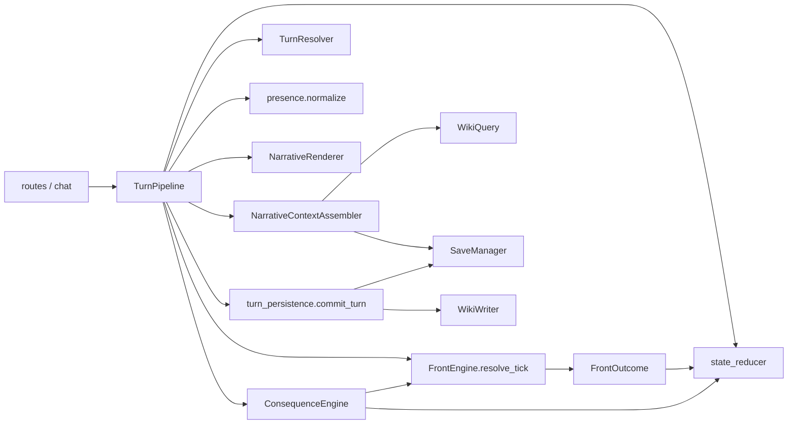
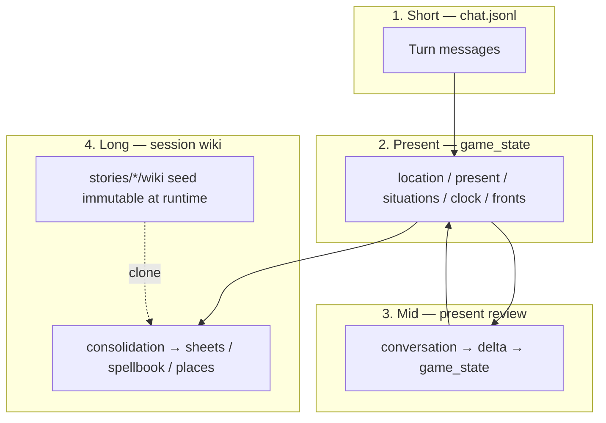
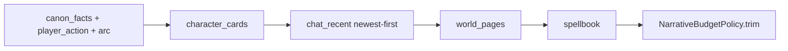
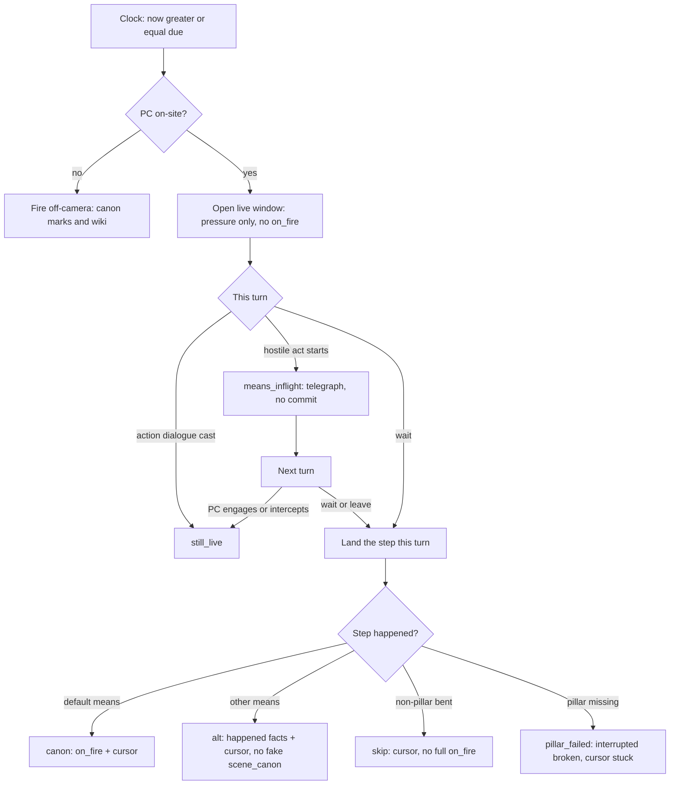
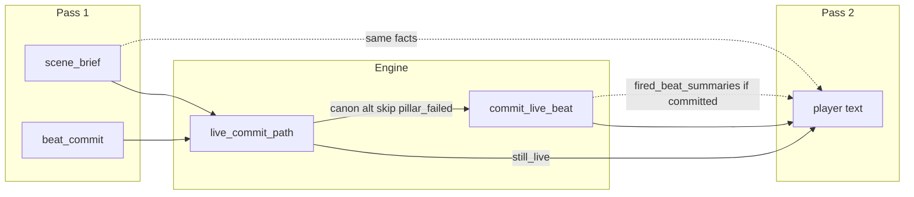
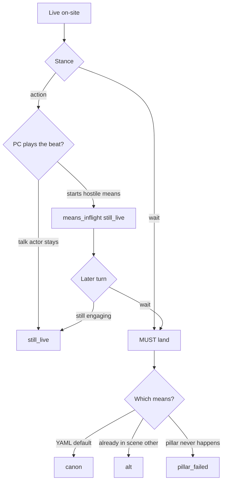
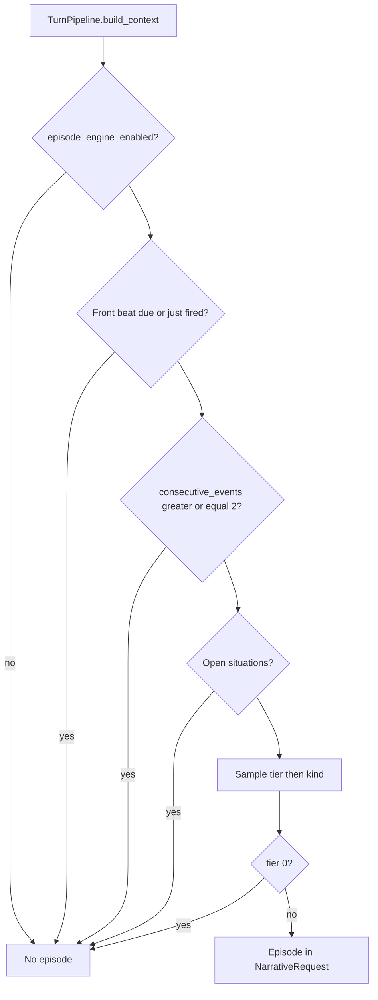
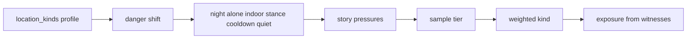
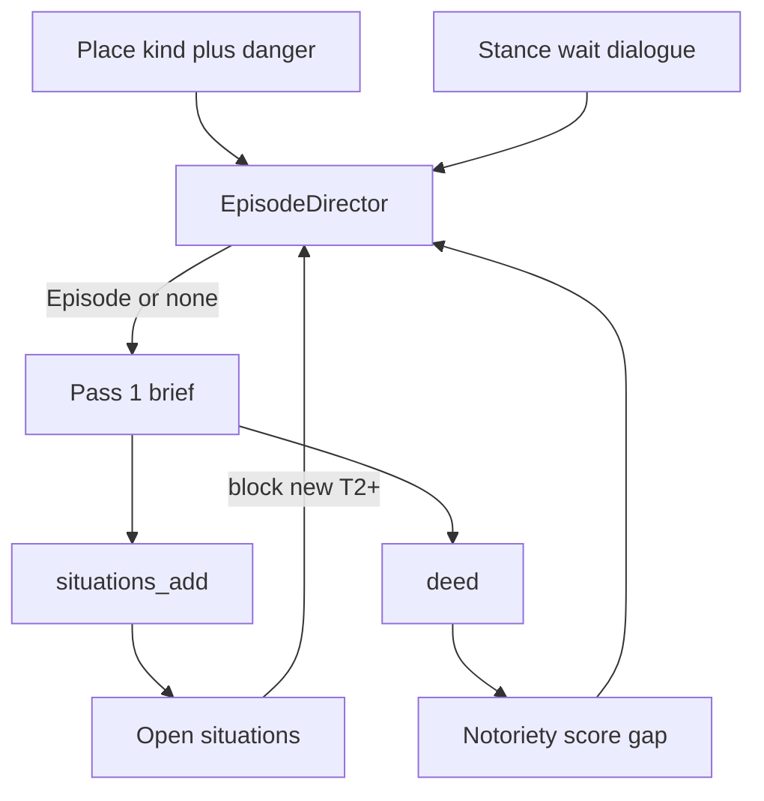

# iaSimulationStory

Layered-memory narrative simulator: a single **state authority**, **two-pass** turns (resolve → render), and setting packs separated from the engine.

**Copyright (c) 2026 Davide Tarquini** — released under the [MIT License](LICENSE). You may use, modify, and redistribute this project (including the architecture and ideas) freely, provided the copyright and license notice are preserved.

---

## Quick start

### Backend

```powershell
cd backend
python -m venv .venv
.\.venv\Scripts\Activate.ps1
pip install -r requirements.txt
copy ..\.env.example ..\.env
# Fill API keys in .env (see Configuration)
uvicorn app.main:app --reload --app-dir .
```

### Frontend

```powershell
cd frontend
npm install
npm run dev
```

- UI: http://localhost:5173  
- API: http://127.0.0.1:8001 (dev proxy; backend default in `start.ps1`)  

On a phone (same Wi‑Fi), from the repo root:

```powershell
.\start.ps1
```

or `start.cmd`. Open `http://<PC-IP>:5173` (Vite proxies `/api` in dev).

### Wiki seed (local)

Setting wiki content is built locally from sources:

```powershell
copy sources.example.yaml sources.yaml
# edit sources.yaml with real URLs
cd backend
python scripts/fetch_sources.py
python scripts/ingest.py
```

Per story pack, also copy meta if needed:

```powershell
copy stories\overlord\meta.example.yaml stories\overlord\meta.yaml
# edit start_location, default_front, playable_characters, …
```

`wiki/` under each story pack is local (not in git). Build sheets via ingest from `sources.yaml`; keep fronts/overlays/index with your private seed.

---

## Setting packs

- **Engine** (`backend/prompts/`): generic turn, review, and structural ingest rules (no setting lore). Shared fragments live in `backend/prompts/_shared/`.
- **Pack** (`stories/<id>/`):
  - `meta.yaml` (from `meta.example.yaml`) — genre, tone, start, default front
  - `wiki/` seed — fronts, sheets, overlays
  - `eras/*.yaml` — era constraints / overlay ids for the story runtime
  - `events.yaml` — episode-tier weights, location bands, notoriety scale labels (opaque to the engine)
  - optional `prompts/ingest.md`, `prompts/episode.md`
- Base sheets = invariants; overlays `wiki/overlays/<arc_id>/` = era titles / goals / knowledge.
- At runtime `WikiQuery` merges base + active overlays (combat/magic sections in overlays are ignored).
- A new setting ≈ a new pack, without rewriting engine prompts.

Ingest (`--force`, `--only`, `--limit` on `ingest.py`) writes only to the seed, runs linkify at the end, and each new session clones the seed into `saves/<id>/wiki/`.

---

## API

| Method | Path | Purpose |
|--------|------|---------|
| GET | `/api/config` | Review intervals / UI config |
| GET | `/api/stories` | Available stories |
| GET | `/api/saves`, `/api/saves/active` | Sessions |
| POST | `/api/session` | New game (`story_id`, `player_name`) |
| GET | `/api/session/{id}` | State + chat |
| GET | `/api/session/{id}/sheet` | Player sheet |
| GET | `/api/session/{id}/spellbook` | Spellbook |
| GET | `/api/session/{id}/arc-timeline` | Arc timeline |
| GET | `/api/session/{id}/can-undo` | Undo availability |
| POST | `/api/session/{id}/undo-last-turn` | Restore last turn checkpoint |
| POST | `/api/chat` | Player action |
| POST | `/api/end-scene` | Session wiki consolidation |
| GET | `/api/state/{id}`, `/api/chat/{id}` | State / full chat |

Routers are split under `backend/app/api/routes/` (`sessions`, `catalog`, `gameplay`, `player_assets`). Session create goes through `application/create_session.py`.

Without LLM keys the backend can answer with mock text for smoke tests.

### Configuration (`.env`)

See `.env.example`:

- `OPENAI_API_KEY`, `LLM_API_BASE_URL` — review / ingest  
- `OPENROUTER_API_KEY` — narrative when the model slug is `provider/model`  
- `GEMINI_API_KEY` — when the model name starts with `gemini`  
- `LLM_MODEL_NARRATIVE` / `RESOLVE` / `RENDER` / `REVIEW` / `INGEST`  
- `PRESENT_REVIEW_EVERY_N`, `CONSOLIDATE_EVERY_N`  
- budget: `NARRATIVE_TOKEN_BUDGET`, `NARRATIVE_CHAT_MESSAGES`, `WIKI_PAGE_CAP`, `WORLD_EXCERPT_CHARS`, `LLM_MAX_OUTPUT_TOKENS`, `NARRATIVE_MAX_WORDS`  

Empty `RESOLVE` / `RENDER` fall back to `LLM_MODEL_NARRATIVE`. Full defaults live in `backend/app/config.py` (`0` disables the related limit).

---

## Architecture

### Backend layout

The engine is split by concern (compat shims remain under `app/services/`):

| Package | Role |
|---------|------|
| `app/turn/` | Pipeline, clock, scene reducer, chat helpers |
| `app/story/` | Fronts, eras, story/chronicle close, catalog |
| `app/wiki/` | Query, writer, overlays, ingest normalize, spell tags |
| `app/episodes/` | Ambient episodes, notoriety/deeds, thread registry/stall, present-review glue |
| `app/narrative/` | Assembler, resolver, renderer, stance, action tags, budget |
| `app/player/` | Presence, places, lens/knowledge, character create |
| `app/persistence/` | Saves, undo slots, `commit_turn` |
| `app/llm/` | LLM client |
| `app/application/` | Session wiring / create |

Tests follow the same split (`tests/turn`, `tests/story`, `tests/episodes`, …).

### Components



### Turn sequence (two-pass)


Turn stance: `action` | `passive` | `wait`.

- `passive` — small observable delta  
- `wait` — advances the clock. **If a live front beat is open**, that step **lands** this turn (prose and state must match; no extra telegraph). **If no live front**, wait does not close an arc: the episode director may open a motif on the first wait, and a **repeated** wait pushes toward silence so Pass 1 advances the open thread instead (see [Free play](#free-play-no-live-arc)).  
- explicit dialogue → always `action`

### Memory (4 layers)



| Layer | Path | Writer | Lifecycle | Belongs here | Does not belong |
|-------|------|--------|-----------|--------------|-----------------|
| Canon seed | `stories/<story_id>/wiki/` | Ingest/CLI only | Cloned into new games; never mutated at runtime | Canon, front YAML, index | Session memories / open threads |
| Session wiki | `saves/<session_id>/wiki/` | Consolidation + beat `wiki_writes` + spellbook | Private per adventure | Dense memories, open threads, place events/tensions, spellbook | Micro-actions, momentary tone, raw transcript |
| Mid state | `saves/<session_id>/game_state.json` | TurnPipeline + present review | Every turn (atomic save) | location, present, situations, clock, fronts, mood/relationships | Long canon, undued future beats |
| Short chat | `saves/<session_id>/chat.jsonl` | `commit_turn` | Append per exchange | Turn prose + player actions | Wiki patches, internal counters |

**Promotion:** chat → present review → situations/runtime → consolidation → session wiki.  
**Removal:** present review drops stale situations; consolidation may `state_cleanup` after promotion.

### Context budget



`NarrativeBudgetPolicy` trims by priority up to `narrative_token_budget` (`0` = off): core → NPC cards → recent chat (newest first) → world → spellbook → arc trim.

---

## Turn context contract

The turn is **two-pass**. Pass 1 decides *what happened* as structured facts (no prose). Pass 2 turns those facts into player-facing text. Clock, location, and presence are applied **between** the passes, so the renderer always sees **post-clock** canon.

### What goes into the LLM

| Kind | Fields | Notes |
|------|--------|--------|
| **Always** | `player_action`, `canon_facts`, `stance`, `chat_recent`, `story_context` | Core continuity |
| **Pass 1 only** | `active_arc`, `episode`, `thread_hint` | Front slice (empty if none); ambient episode; stall hint |
| **Selective** | `character_cards`, `world_pages`, `spellbook` | On-scene NPCs; place/mention pages; known spells |
| **Pass 2 only** | `scene_brief`, `temporal_context`, `fired_beat_summaries`, `interrupt_hint` | After resolve + front tick |
| **Never (renderer)** | Upcoming beats / future `active_arc` | Avoids spoilers and railroading |

**`canon_facts`** (absolute for both passes; Pass 2 sees them after clock/location/present updates):

- `location` — current place id  
- `time` — label (`Giorno N · fase`)  
- `present` — NPCs physically with the PC  
- `situations` — mid-term open threads (serialized with an epistemic note: continuity for the *model*, not automatic NPC knowledge)  
- `extra` — free-form structured flags  

**`story_context`** — genre + narrative style from the pack `meta.yaml`.  
**`stance`** — `action` | `passive` | `wait` (classified from the player message).

### Player-action grammar (both passes)

Markers are interpreted in **literal order** (do not reorder):

| Marker | Meaning |
|--------|---------|
| `"..."` / `«...»` | Spoken dialogue |
| `[Name — desc]` / `[Name]` | Spell cast (new spell → `spells[]`; bare name → do not invent a description) |
| `*...*` | Private thought (NPCs do not hear it) |
| Free text | Physical / scene action |

### Pass 1 — Resolver (`turn_resolve.md`)

**Input:** `NarrativeRequest`  
`canon_facts`, `active_arc` (empty in free play), `episode` (optional ambient opening), `thread_hint` (optional stall), `world_pages`, `character_cards`, `spellbook`, `chat_recent`, `player_action`, `stance`, `story_context`

**Output:** `TurnResolution` — **no `text` field**:

| Field | Meaning |
|-------|---------|
| `time` | `{ bucket, minutes }` — clock advance (`istantanea` / `breve` / `media` / `lunga` / `riposo`) |
| `location` | New place id if the PC moved; else `null` |
| `present` | Full replacement list of who is with the PC; `null` = unchanged; `[]` = alone |
| `spells[]` | Newly declared `[Name — desc]` only |
| `scene_brief[]` | 1–4 **fact bullets** for the renderer (deltas, not prose) |
| `situations_add[]` / `situations_remove[]` | Mid-term threads to open/close (`remove` = existing **ids**) |

Stance shapes the brief: `passive` stays small; `wait` **lands** the live front step when a live beat is open (not a micro-telegraph). Without a live front, `wait` is still a real svolta (episode or open thread), not empty minutes. Explicit dialogue stays `action`.

Pass 1 may also emit `present_join` / `present_leave`, `player_findings_*`, `deed`, `npc_knowledge_upsert`, and `beat_commit` (how a live arc beat stays open or closes).

After Pass 1 the pipeline: normalizes presence (including distant-cast join when the PC talks to them) → applies scene delta → runs `FrontEngine.resolve_tick` → then rebuilds cards for Pass 2 with updated clock/place.

### Pass 2 — Renderer (`narrative_render.md`)

**Input:** `NarrativeRenderRequest`

| Field | Role |
|-------|------|
| `canon_facts` | **Post-clock** canon (must not be contradicted) |
| `player_action`, `stance` | Same markers as Pass 1 |
| `scene_brief` | Structural facts from the resolver (integrate once; do not paste as an outline) |
| `temporal_context` | Era constraints (titles / public knowledge); overrides future biography on cards |
| `story_context` | Pack tone/genre |
| `interrupt_hint`, `fired_beat_summaries` | Front events **already** materialized this turn |
| `character_cards`, `chat_recent`, `spellbook` | Voice, continuity, known magic |
| `world_pages` | Usually only when casting (e.g. magic tier / scale) |

Does **not** receive future arc / upcoming beats.

**Output:** `NarrativeRenderResult` — `{ "text": "..." }` Italian second-person prose for the player.

Rules of thumb: one scene beat; honor player markers in order; do not rehash what `chat_recent` / `canon_facts` already established; use `scene_brief` and fired beats as content constraints, not copy-paste.

`narrative.md` is legacy single-pass only (unused by the live pipeline).

---

## Fronts and eras

### Fronts (`FrontEngine`)

Arc YAML under `stories/<id>/wiki/fronts/` (cloned into the save wiki). A beat is **not** a cutscene to reprint. `scene_canon` is the **default means** for that step, not a script the engine must stamp.

**Pillar** (`pillar: true` on the beat): the **step** the arc needs, by any means. Missing → the YAML tail is invalid; the front breaks (`interrupted` / `broken`) and the world reacts with a new story. Same step with another means → pillar **valid**, queue continues (`alt`). Non-pillar beats can be skipped/distorted; the tail may continue.

The engine reads only the flag. Pack authors mark pillars in YAML. Timeline UI (`GET .../arc-timeline`) shows status plus **pilastro** / **flessibile**.



#### Clock vs live

- Off-site + due → the beat **must** fire (world continues without the PC).
- On-site + due → **live**: atmosphere/ambient, no marks/wiki until commit.
- Leaving the place while live → commit off-camera (currently canon).

#### Agency vs state (alignment)

Two constraints, one truth:

| Layer | Role |
|-------|------|
| Pass 1 `scene_brief` + `beat_commit` | What happened **this turn** (facts, not prose) |
| Engine commit | Writes flags/wiki/cursor **only** for those facts |
| Pass 2 prose | Shows the same facts. Hostile acts **new** this turn stay in flight unless `wait` / already telegraphed / already committed |

Never stamp `scene_canon` (or `fired_beat_summaries` from it) if that text did not happen. Never narrate a telegraph after the engine has already closed the beat.



#### Live commit paths

| Path | When | State |
|------|------|--------|
| `still_live` | PC plays the scene (talk, cast, inflight). Echo/`progress_key` alone does **not** force canon | Window stays open; `live_means_inflight` if a hostile act started |
| `canon` | Step happened with the default means | Full `on_fire` (marks, wiki, location events) + cursor |
| `alt` | Same **step**, different means (already in the scene) | Cursor + marks that belong to the step; **no** closing wiki copied from `scene_canon` |
| `skip` | Non-pillar beat bent | Cursor advances; no canon stamp |
| `pillar_failed` | Pillar step did not happen | Front `interrupted`, story `broken`, cursor **does not** advance |

`wait` while live: the step **lands this turn**. Brief = completed fact; `means_inflight: false`; `still_live` forbidden. Prose must show the impact, not another micro-telegraph (rumble grows, crack lengthens). If the means in chat is not the YAML default → `alt`.

`action` / dialogue: the actor may answer; a new hostile act is telegraphed only. State stays live until wait, leave, or an explicit land.

Distant / `narrate_symptoms_or_edge` does **not** auto-join named cast into `present`. If the PC talks and they answer → `present_join` so UI and dialogue match.



### Eras and story close (`StoryEngine`)

`stories/<id>/eras/` plus front `on_close` outcomes (`canon` | `weak` | `diverted` | `broken` | `lapsed`). Overlay merge order: era, then active/diverted fronts. Chronicle and world flags update on arc close (`review_arc_close.md` when enabled).

---

## Free play (no live arc)

Start mode `free`: no beat queue is running. Optional `front_id` only **seeds** that arc off-camera (`seed_world_after_arc`: wiki/clock as if the YAML already happened, front left `resolved`). The PC then walks a living world; pressure does **not** come from `cursor_beat`.

What keeps the world moving is `EpisodeDirector` (`app/episodes/`), driven by pack `stories/<id>/events.yaml` (engine defaults if the file is missing). Labels and kind ids are opaque strings to the engine. The director also runs **during** an arc when no front beat is due — it never competes with a live/imminent beat.

### When a turn can open an episode



Hard suppress (in order):

1. Engine flag off
2. A hydratable front beat is due **now** at the PC (`beat_imminent`), or a front beat fired last turn
3. Two episode openings in a row (`consecutive_events >= 2`) — the scene must digest them
4. Any open `situations` — new T2+ is blocked until that narrative debt moves

If the roll lands on tier 0 (`niente`), there is no episode. Tier 1 (`segno`) is never sampled.

### How the roll is weighted

Seven slots `[T0 … T6]`. Start from the **location profile**, then multiply modifiers. Location `kind` / `danger` come from wiki frontmatter (`WikiQuery.read_location_meta`); if missing, `infer_location_kind` from the place id (inn, settlement, road, wilderness, outpost, ruin, fortress → `default` profile if the pack has no `fortress` row).

| Location kind | Shape (pack default) |
|---------------|----------------------|
| `inn` / `settlement` | More T2 hooks, almost no T5–T6 |
| `road` | Mix of hook and complication |
| `wilderness` / `ruin` | Less silence, more threat and environmental |
| `outpost` | Between settlement and wild |

Then, in order:

| Modifier | Effect |
|----------|--------|
| `danger` high/low | Shifts mass toward T4–T6 or toward T0/T2 |
| `baseline_calm` | Slightly more silence when there is no debt (debt already gated) |
| `night` | Less quiet; more T4–T6 |
| `alone` (empty `present`) | Fewer social-tier weights; more late tiers |
| `indoor` (inn/settlement) | More T2–T3, less T5–T6 |
| `stance_wait` | First wait: less T0, more event |
| `stance_wait_repeat` | Second wait in a row: **hard toward T0** so Pass 1 must advance the thread the PC is waiting on, not invent a new motif |
| `stance_dialogue` | Much more T0 (conversation is the scene) |
| `cooldown` | After a real episode: quiet turns (T2 → 1 turn, T3–4 → 2, T5–6 → `episode_cooldown_turns`) |
| `quiet_streak` | Each silent turn ramps event mass (capped) |
| story `pressures` (layer-3 leftovers) | Mild bias away from T0 |
| last T5/T6 this turn | T5 and T6 zeroed |

RNG is deterministic per `session_id` + `turn_index` (+ optional salt).



### Kind (what kind of opening)

After the tier, a **kind** is sampled among those allowed for that tier. Each kind has `by_location` weights (inn favors `social` / `opportunity`; wilderness favors `threat` / `environmental` / `discovery` / `mystery`). The last two used kinds are barred; older ones recover.

Notoriety then reweights kinds (`notoriety_kind_weights`):

- **low** score: more social / opportunity / discovery
- **high** score (≥ 40): more `arrival` / `mystery`, less cozy opportunity
- **gap** (deeds outrank formal labels): same tilt, stronger mystery/arrival

The director does **not** write prose. It emits:

| Field | Meaning |
|-------|---------|
| `tier` / `tier_label` | Gravity vs ordinary world means (not vs the PC) |
| `kind` | `threat` `social` `discovery` `arrival` `environmental` `opportunity` `mystery` |
| `exposure` / `witnesses` | How public: present NPCs mapped to roles, plus ambient civilian in inn/settlement |
| `no_auto_damage` | No HP/loot loss invented by the opening |
| `must_not_resolve` | Must not close a campaign; **does** allow moving already-open threads |
| `opens_thread` | T2+ → `thread_registry` may add a situation so the next rolls stay gated |

### Pass 1 / Pass 2 (free play)

Pass 1 **must** put the episode in `scene_brief` (neutral: no “hide or reveal” advice). T2 is playable; a new named presence only if `kind = arrival`. Unresolved openings become situations (cap 6). Repeated waits without a new episode must **advance the existing thread** (`stance_wait_repeat` + `thread_hint` from `thread_stall`).

Pass 2 narrates that brief. Agency still applies: a **new** hostile beat telegraphs; `wait` on something already in scene lands it. Episodes are not front `on_fire`.

### Deeds and notoriety (the world reading the PC)

If Pass 1 fills `deed` (scale band from `scale_bands`, witness **roles**, optional evidence/beneficiary), `apply_deed` raises `notoriety.score` (or `legend_score` if unattributed) and `reach`. Decay is per-day (softer with persistent evidence). The **gap** between implied band and formal labels feeds the next kind table. Pack `prompts/episode.md` may explain bands for the LLM; the engine only sees ids.



Player-private magic (`output: info`) still goes to `player_findings`, not NPC knowledge, until the PC speaks it.

---

## Frontend

Vite app with `/api` proxy. Optional PWA (`vite-plugin-pwa`, `src/pwa.tsx`) for install-on-device. Session UI: chat, sheet, spellbook, arc timeline, undo last turn.

---

## Invariants

- Scene mutations only via `apply_scene_delta` / `apply_front_outcome` (`state_reducer`).
- Front impacts applied by `FrontEngine.apply_impacts` (not the reducer).
- `resolve_tick` mutates front runtime only; scene + wiki patches live in `FrontOutcome`.
- One atomic `save_game_state` per turn in `commit_turn`; scheduled reviews persist their own deltas afterward.
- Stable `ChatResponse` toward the frontend.
- Consolidation does not write chat; it may `state_cleanup` situations after wiki promotion.
- Each adventure clones the seed: actions never contaminate other saves or the seed.
- Engine prompts contain no pack lore; episode weights and pillar flags live in the story pack.
- Undo checkpoints are written at the start of a turn and restored via `POST .../undo-last-turn`.

---

## License

Copyright (c) 2026 Davide Tarquini.

This project is licensed under the MIT License — see [LICENSE](LICENSE) for the full text.
